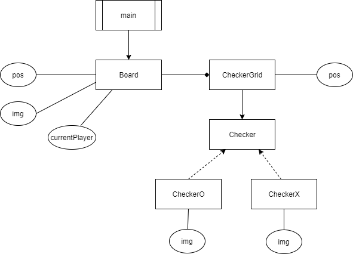
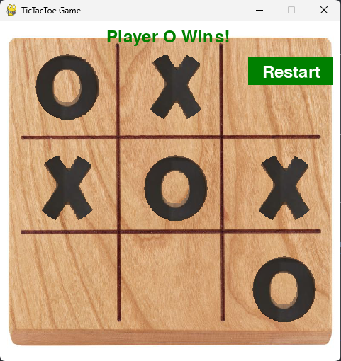

# Python OOP Practice: TicTacToe Game

## Overview

This project is a practice exercise for learning Object-Oriented Programming (OOP) concepts in Python. It implements a simple Tic Tac Toe game using the Pygame library for a graphical interface. The game allows two players to take turns placing 'X' or 'O' on a 3x3 grid, checks for win conditions or draws, and provides an option to reset the game.



## Play

To play, download the source code and run `main.py`. Click on the grid to place your checker. The game alternates between Player X and Player O. When the game ends (win or draw), press 'R' to reset and start a new game.



## Learning OOP Concepts

This section explains key Object-Oriented Programming concepts demonstrated in the TicTacToe project, with examples from the codebase to help you understand how these principles are applied in practice.

### 1. Classes and Objects

**Concept**: A class is a blueprint for creating objects, which are instances of the class. Objects encapsulate data (attributes) and behavior (methods) related to a specific entity.

**Example**: In `checker.py`, the `Checker` class is defined as a base class for game pieces. It encapsulates attributes like `value` (either 'X' or 'O'), `img` (the image to display), and `position` (where on the screen to display it). Methods like `display()` define behavior to render the checker on the screen.

```python
class Checker:    
    def __init__(self, val:str, img:any, pos:tuple[int,int]) -> None:
        self.value = val
        self.img = pygame.transform.scale(img, (100,100))
        self.position:tuple[int,int] = pos
    
    def display(self, screen) -> None:
        screen.blit(self.img, self.position)
```

**Usage**: Objects of `Checker` are created in `board.py` when a player clicks to place a checker, e.g., `CheckerX(checkData.pos)` creates an 'X' checker at a specific position.

### 2. Inheritance

**Concept**: Inheritance allows a class to inherit attributes and methods from another class, promoting code reuse and establishing a hierarchical relationship between classes.

**Example**: In `checker.py`, `CheckerO` and `CheckerX` are subclasses that inherit from the `Checker` base class. They specialize the base class by loading specific images for 'O' and 'X' checkers but reuse the `display()` method from `Checker`.

```python
class CheckerO(Checker):
    imgO:any = pygame.image.load("checker_O.png")
    
    def __init__(self, pos:tuple[int,int]):
        super().__init__("O", self.imgO, pos) 

class CheckerX(Checker):
    imgX:any = pygame.image.load("checker_X.png") 
    def __init__(self, pos:tuple[int,int]):
        super().__init__("X", self.imgX, pos) 
```

**Usage**: This allows for polymorphic behavior where the game can treat both `CheckerO` and `CheckerX` as `Checker` objects, simplifying code in `board.py` when displaying checkers.

### 3. Encapsulation

**Concept**: Encapsulation is the bundling of data and the methods that operate on that data within a single unit (class), restricting direct access to some of an object's components to protect the integrity of the data.

**Example**: In `board.py`, the `Board` class encapsulates the game state, including `currentPlayer`, `gameOver`, `winner`, and `checkerPositions` (a grid of `CheckerGrid` objects). Methods like `setNewChecker()` and `checkWinCondition()` manage how this data is modified and accessed.

```python
class Board:
    def __init__(self, x:float, y:float, width:int, height:int) -> None:
        self.pos:tuple[float,float] = [x,y]
        self.currentPlayer:str = 'x'
        self.gameOver:bool = False
        self.winner:str = None
        self.statusMessage:str = "Player X's Turn"
        self.checkerPositions:list[list[CheckerGrid]] = []
        # ... initialization of grid ...
```

**Usage**: Encapsulation ensures that the game logic (like alternating players or determining a win) is handled internally by the `Board` class, preventing external code from directly manipulating the game state in unintended ways.

### 4. Modularity and Abstraction

**Concept**: Modularity involves dividing a program into separate modules or classes to manage complexity. Abstraction hides complex implementation details behind simpler interfaces.

**Example**: The project is modular with separate files for different components: `main.py` for the game loop, `board.py` for game logic, and `checker.py` for checker representation. The `Board` class abstracts the complexity of managing the game grid and win conditions behind methods like `onEvent()` and `display()`.

**Usage**: In `main.py`, the game loop interacts with the `Board` class through high-level calls like `board.display(screen)` and `board.onEvent(event)`, without needing to know the internal details of how the board manages checkers or checks for a win.

```python
while keep_going:
    screen.fill(0)
    board.display(screen)
    pygame.display.flip()
    for event in pygame.event.get():
        board.onEvent(event)
```

### 5. State Management

**Concept**: OOP often involves managing the state of an application within objects, allowing for dynamic behavior based on user interactions or game rules.

**Example**: The `Board` class in `board.py` manages the game state with attributes like `gameOver` and `statusMessage`. When a player places a checker, it updates the state and checks for win conditions, altering the `statusMessage` to inform players of the game's progress.

```python
def setNewChecker(self, pos:tuple[int,int]) -> None:
    if self.gameOver:
        return
    checkData:CheckerGrid = self.findBoardPos(pos)
    if checkData != None and checkData.checker is None:
        if self.currentPlayer == 'x':
            checkData.checker = CheckerX(checkData.pos)
            self.currentPlayer = 'o'
            self.statusMessage = "Player O's Turn"
        else:
            checkData.checker = CheckerO(checkData.pos)
            self.currentPlayer = 'x'
            self.statusMessage = "Player X's Turn"
        self.checkWinCondition()
```

**Usage**: This state management allows the game to respond to user actions, display whose turn it is, and end the game appropriately when someone wins or the game is a draw.

## Conclusion

This TicTacToe game demonstrates how OOP concepts like classes, inheritance, encapsulation, modularity, abstraction, and state management can be applied to create a structured and maintainable program. By studying this code, you can learn how to design software where different components have clear responsibilities and interact in a cohesive way.

## Setup Instructions

1. Ensure you have Python installed on your system.
2. Install Pygame if not already installed: `pip install pygame`.
3. Download the project files, including the image assets (`board.jpg`, `checker_O.png`, `checker_X.png`).
4. Run `main.py` to start the game: `python main.py`.

## Game Rules

- The game starts with Player X's turn.
- Click on an empty grid cell to place your checker.
- The game alternates between Player X and Player O.
- The first player to get three of their checkers in a row (horizontally, vertically, or diagonally) wins.
- If all cells are filled and no player has won, the game is a draw.
- Press 'R' to reset the game after it ends.